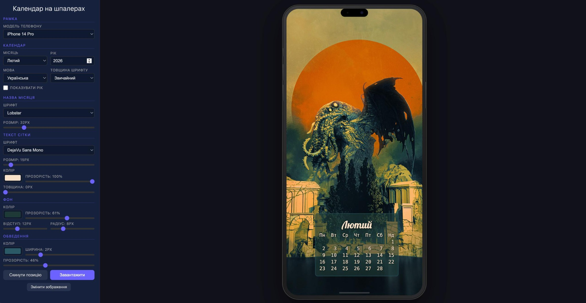

 # Calendar Image Overlay Service

A lightweight web service that overlays a monthly calendar onto an uploaded image.
Supports **English** and **Ukrainian** languages. Designed to run on Raspberry Pi 4.

## Screenshot



## Features

- Upload any image (JPEG, PNG, etc.)
- Select month, year, and language (EN / UA)
- Drag the calendar overlay to position it on the image
- Resize via the corner handle or font size slider
- Customize text color and opacity
- Download the final composited image

## Quick Start

```bash
# 1. Create a virtual environment
python3 -m venv venv
source venv/bin/activate

# 2. Install dependencies
pip install -r requirements.txt

# 3. Run the service
python app.py
```

Open **http://\<your-pi-ip\>:5555** in a browser.

## Run as a systemd Service (auto-start on boot)

Create `/etc/systemd/system/calendar-service.service`:

```ini
[Unit]
Description=Calendar Image Overlay Service
After=network.target

[Service]
Type=simple
User=pi
WorkingDirectory=/home/pi/calendar_service
ExecStart=/home/pi/calendar_service/venv/bin/python /home/pi/calendar_service/app.py
Restart=on-failure
RestartSec=5

[Install]
WantedBy=multi-user.target
```

Then enable and start:

```bash
sudo systemctl daemon-reload
sudo systemctl enable calendar-service
sudo systemctl start calendar-service
```

## Docker

```bash
# Build the image
docker build -t calendar-service .

# Run locally
docker run -p 5555:5555 calendar-service
```

Open **http://localhost:5555**.

### Deploy to DigitalOcean App Platform

1. Push the repo to GitHub/GitLab.
2. Go to **DigitalOcean > App Platform > Create App**.
3. Select the repository and branch.
4. Set the **source directory** to `calendar_service/` (if the Dockerfile isn't at repo root).
5. DigitalOcean auto-detects the Dockerfile. Set the **HTTP port** to `5555`.
6. Choose a plan (Basic $5/mo is plenty) and deploy.

### Deploy to a DigitalOcean Droplet

```bash
# On the droplet
git clone <your-repo> && cd calendar_service
docker build -t calendar-service .
docker run -d --restart unless-stopped -p 80:5555 --name calendar calendar-service
```

## File Structure

```
calendar_service/
  app.py              # Flask backend + Pillow image rendering
  requirements.txt    # Python dependencies
  README.md           # This file
  templates/
    index.html        # Web UI
  static/
    style.css         # Styling
    app.js            # Frontend logic (drag, resize, API calls)
  fonts/
    DejaVuSansMono.ttf       # Monospace font (Cyrillic support)
    DejaVuSansMono-Bold.ttf  # Bold variant
```

## Requirements

- Python 3.9+
- ~50 MB RAM at runtime
- Works on Raspberry Pi OS (Bookworm or Bullseye)
